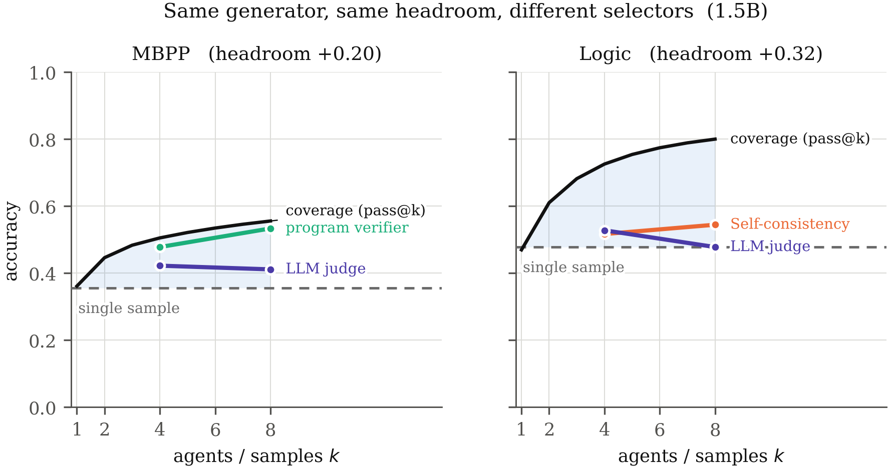
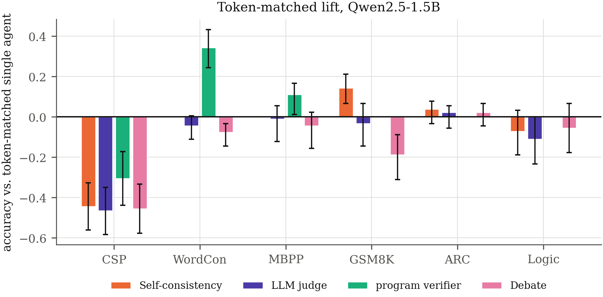
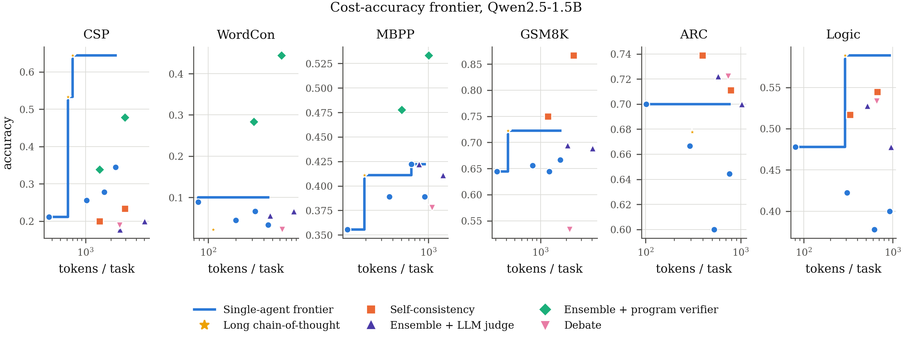
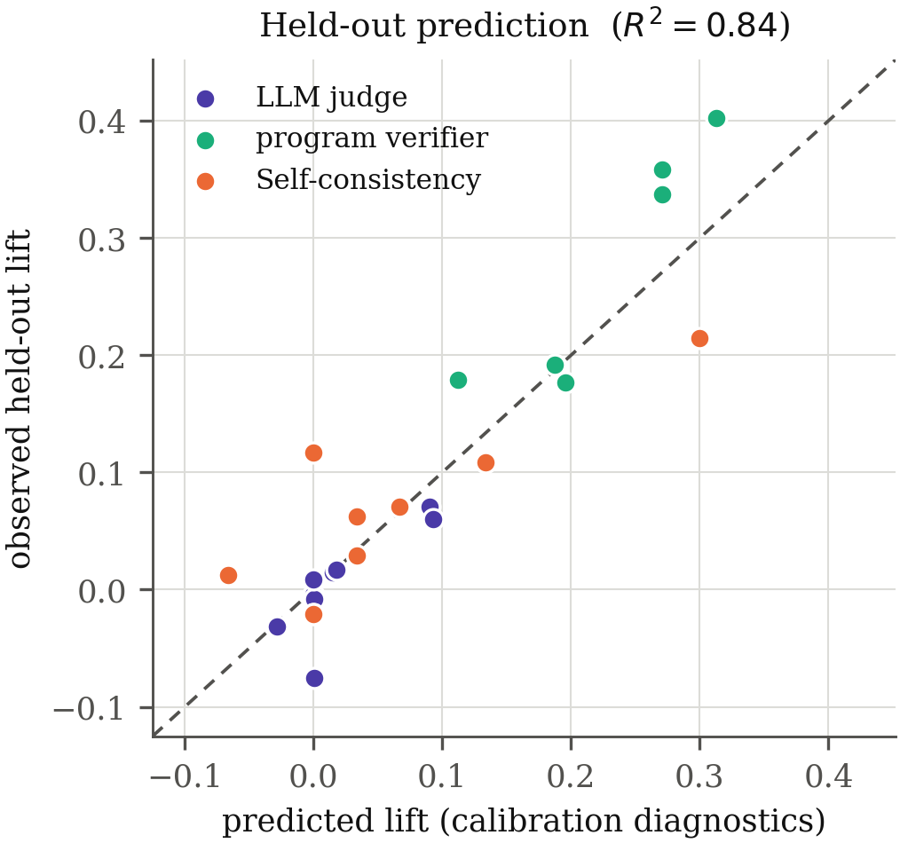

<div align="center">

# The Generator–Verifier Gap

### Predicting When Multi-Agent LLM Architectures Beat a Compute-Matched Single Agent

**Madhavam Pratap Shahi** · **Kavish Soningra** · **Nagendra Chaudhary**

*Independent Researchers*

[](paper/main.pdf)
[](LICENSE)
[](https://www.python.org/)
[](#reproducing-every-number)

</div>

---

## TL;DR

A $k$-agent ensemble can only be as good as the best candidate it produces, and
it realises that potential only insofar as its selector can tell good
candidates from bad. We make both factors measurable, show that **most reported
multi-agent gains disappear once the baseline is given the same token budget**,
and give a diagnostic that predicts the benefit *before the system is built*.

> **Multi-agent structure is not a general accuracy technique.** It is a way of
> spending compute that pays off exactly when checking an answer is easier than
> producing one.

---

## The central claim in one figure

Two task families, the same generator, the same amount of compute. The shaded
band is **coverage headroom** — accuracy that already exists in the candidate
pool. How far a selector climbs into that band is its **selection efficiency**.



On **MBPP** a program verifier converts most of the headroom. On **Logic** the
same model judging its own answers ends up *below* a single sample. Nothing
about the generator changed — only whether the task admits a cheap check.

---

## Key results

| | |
|---|---|
| Apparent gains that vanish under token-matching | **47%** |
| Configurations net-negative vs. one agent | **56%** |
| Median lift, naive → token-matched | **+0.036 → −0.028** *(sign flip)* |
| Held-out lift predicted, **no fitted parameters** | **R² = 0.84** (r = 0.92) |
| Generator–verifier gap range observed | **−0.27 to +0.42** |
| Statistically significant cells (Holm-corrected) | 22 / 64 |

### Which architectures actually survive a fair comparison

| Architecture | Naive lift | **Token-matched** | Cells negative |
|---|---:|---:|---:|
| Ensemble + program verifier | +0.189 | **+0.147** | 33% |
| Self-consistency | +0.039 | −0.008 | 50% |
| Ensemble + LLM judge | +0.017 | −0.033 | 67% |
| Debate (3 agents × 2 rounds) | +0.022 | −0.067 | 67% |

*The "naive" column is the comparison most of the literature reports: against a
single agent taking a single sample. The middle column prices the single agent
at the same token budget.*



---

## Why the usual comparison is unfair

A system of $k$ agents spends roughly $k\times$ the tokens. Comparing it to one
agent that answered once credits the architecture for **compute**, not
**coordination**. The honest baseline lets one agent spend the same budget —
thinking longer, or revising its own answer.

We build that baseline as the **upper envelope of two methods** (sequential
self-refinement *and* long chain-of-thought), so a single weak baseline cannot
flatter our own thesis. It matters. On constraint-satisfaction problems, one
agent reasoning at length reaches **0.644 accuracy for 701 tokens**, while
eight agents spending **2,947 tokens** — four times the budget — reach at best
**0.478**, and that is with a *perfect* oracle selector. No deployable
multi-agent configuration on that family comes close to simply letting one
agent think for longer.



---

## The framework

For a selector $\sigma$ over $k$ candidates:

$$A_\sigma(k) \;=\; p_1 \;+\; \underbrace{\eta_\sigma(k)}_{\text{selection efficiency}} \cdot \underbrace{\bigl(C(k) - p_1\bigr)}_{\text{coverage headroom}}$$

where $p_1$ is single-sample accuracy and $C(k)$ is $\mathrm{pass}@k$. Both
factors are separately measurable, and both must be non-trivial:

- **Headroom without a discriminating selector is wasted.**
- **A perfect selector on a pool with no headroom has nothing to find.**

### The cheap diagnostic

Show the model one correct and one incorrect answer and ask which is right.
Repeat ~30 times. The excess over chance is the **generator–verifier gap** $G$.

Because $G$ is *pairwise* while an ensemble chooses *listwise*, we supply the
link with a latent-score model: the verifier scores correct candidates
$\mathcal{N}(\delta, 1)$ and incorrect ones $\mathcal{N}(0,1)$ and takes the
argmax. Then $q = \Phi(\delta/\sqrt{2})$ identifies $\delta$ **with no free
parameters**, and the listwise selection probability follows by integration.



Diagnostics measured on **30 calibration tasks** predict held-out lift at
**R² = 0.84**. Every feature comes from the calibration split; every target
from the held-out split; the split was frozen before any model ran.

---

## An honest negative result

Restricted to the **judge arm alone** — where the latent-score model does all
the work rather than the coarse separation between verifier types — the
prediction attains **R² = 0.52**, and it **over-predicts at the high end**.

We take this as the expected cost of assuming conditionally independent,
equally dispersed scores; a real judge sees all candidates at once and violates
both. We report it rather than adding a free parameter to absorb it.

---

## Case study: citation verification

Reference generation, cast into the same framework. A generator proposes 8
candidate references per topic; a selector picks one; ground truth is whether
the paper exists (CrossRef, with OpenAlex fallback).

| | |
|---|---|
| References fabricated (0.88 title match) | **97.2%** |
| Same, at a 0.70 threshold | 69% |
| Model's pairwise gap on its own citations | **G = −0.67** *(below chance)* |
| Selection efficiency — model as critic | **η = 0.00** |
| Selection efficiency — registry lookup | **η = 1.00**, at zero model tokens |

The model is not credulous but **indiscriminately sceptical**: it rejects 85% of
fabrications *and* 75% of genuine papers. Shown one real and one fake reference,
it prefers the fake more often than not.

The fabrication rate is strongly threshold-dependent, so we report the full
sensitivity curve rather than a single cutoff. The qualitative conclusion
survives every threshold; the point estimate does not.

---

## Experimental design

**540 tasks** across six families chosen so the cost of *checking* an answer
varies by orders of magnitude while the cost of *producing* one does not:

| Family | Verification | Source |
|---|---|---|
| **CSP** | two modulo operations | synthetic |
| **WordCon** | token count + substring test | synthetic |
| **MBPP** | execute held-out unit tests | [Austin et al. 2021](https://arxiv.org/abs/2108.07732) |
| **GSM8K** | redo the arithmetic | [Cobbe et al. 2021](https://arxiv.org/abs/2110.14168) |
| **ARC-Challenge** | essentially re-answering | [Clark et al. 2018](https://arxiv.org/abs/1803.05457) |
| **Logic** | redo the whole derivation | synthetic |

Three families are generated programmatically from a fixed seed: **zero
benchmark-contamination risk**, tunable difficulty, exact verifiers.

**Models.** Qwen2.5-Instruct at 0.5B and 1.5B, `bfloat16`, unquantised, run
locally via MLX on one Apple M4 Pro. **21,847 generations, no API keys, zero
marginal cost** — which matters for a paper whose central claim is about
compute accounting.

### Methodological care worth noting

- **Counterbalanced probes.** Every pair is shown in both orders, so a judge
  that always picks the first option scores exactly chance. Without this, a
  position-picking judge inherits spurious discrimination from sampling
  imbalance — we measured a fake $G = +0.40$ on a cell whose judge chose the
  first option 100% of the time.
- **Frozen calibration split**, assigned before any model ran.
- **Cluster bootstrap over tasks** (10,000 resamples), recomputing *both* arms
  inside each resample, since the baseline is itself an estimate.
- **Holm–Bonferroni** correction across all reported comparisons.
- **No verifier leakage**: on MBPP the selector sees only the single test shown
  in the prompt; grading uses the held-out remainder.
- **Estimators validated against ground truth** — `pass@k` against exhaustive
  enumeration for all $n \le 8$, bootstrap coverage at 0.963 against a nominal
  0.95.

---

## Repository layout

```
gvgap/
  synth.py          generators for the three synthetic families
  build_data.py     assembles the frozen 540-task suite
  verify.py         ground-truth checkers, one per family
  engine.py         batched MLX inference, token accounting, caching
  arch.py           voting · judging · program verifier · debate · refinement
  theory.py         latent-score model: pairwise G → listwise selection
  metrics.py        pass@k, cluster bootstrap, Holm correction
  predict.py        held-out prediction and the build/don't-build rule
  citations.py      CrossRef/OpenAlex resolution for the case study
  report.py         emits every number the paper prints
  figures.py        publication figures
  test_metrics.py   estimator validation against brute force
data/               the frozen task suite (6 × 90 tasks)
results/raw/        per-task outcomes for every architecture
paper/              LaTeX source, 8 figures, main.pdf
  main.tex          preprint build (article, one column)
  main_ieee.tex     IEEE build (IEEEtran, two columns, same sections)
```

Both builds share every section file, table, figure, `numbers.tex` and
`abstract.tex`, so results only ever have to be regenerated once:

```bash
cd paper && pdflatex main_ieee && bibtex main_ieee && pdflatex main_ieee && pdflatex main_ieee
```

## Reproducing every number

```bash
pip install -r requirements.txt

python3 gvgap/build_data.py      # rebuild the frozen task suite
python3 gvgap/run.py             # all models × families (resumable)
python3 gvgap/run_citations.py   # citation case study
./run_analysis.sh                # tables, figures, compiled PDF
```

Every generation is cached by a hash of *(model, prompt, max tokens,
temperature, seed)*, so an interrupted run resumes for free and a repeat run
costs nothing. `results/raw/` ships with the repo, so **every number in the
paper can be re-derived without a GPU**.

Requires Python 3.9+, `mlx`, `mlx-lm`, and `tectonic` for the PDF. Apple
Silicon for inference; analysis runs anywhere.

---

## Limitations

We state these plainly rather than in a footnote.

- **Two model scales (0.5B, 1.5B).** Frontier models are better verifiers, so
  $G$ should be larger for them. What is scale-independent is the
  decomposition — it is an identity — and the token-accounting argument.
  Whether our specific numbers transfer is an open empirical question.
  `gvgap/run.py` runs a 3B scale point by uncommenting one line.
- **Two points establish no trend.** The scale section shows the diagnostics
  are model-dependent, not task-intrinsic. It licenses no extrapolation.
- **The latent-score model is a simplification** that assumes conditionally
  independent, equally dispersed scores. Real judges violate both.
- **The case study has low coverage** — only 6 of 40 topics contain any real
  reference — so its selection efficiencies are directional, not precise.
- **Six families are a sample, not a census**, and our synthetic ones are
  exactly checkable by construction, which makes them unrepresentative of
  open-ended work where no ground truth exists at all.

---

## Citation

```bibtex
@article{shahi2026generator,
  title  = {The Generator--Verifier Gap Predicts When Multi-Agent LLM
            Architectures Beat a Compute-Matched Single Agent},
  author = {Shahi, Madhavam Pratap and Soningra, Kavish and
            Chaudhary, Nagendra},
  year   = {2026}
}
```

## License

MIT for the code. Benchmark data retains its original licensing
(GSM8K, MBPP, ARC).
